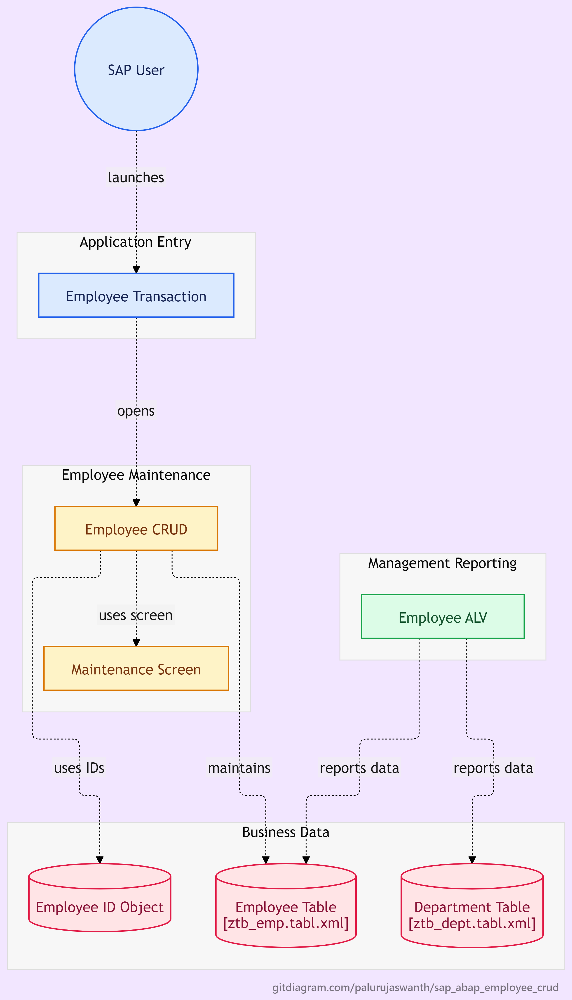

# Enterprise Employee Maintenance Dialog Application (SAP ABAP Dynpro)

An end-to-end custom SAP ABAP Dialog Application (Module Pool) engineered to manage employee records with transactional CRUD capabilities, real-time relational lookups, dynamic screen flow logic, and custom GUI status controls[cite: 9, 13].

---

## 📌 Project Overview

This repository contains the complete abapGit serialized source code and Data Dictionary structures for transaction **`ZEMP_MAINT`**. The application provides an interactive Dynpro maintenance screen (`0100`) allowing business users to create, search, update, and delete employee records while automatically fetching corresponding department master details.

The project demonstrates classic event-driven screen processing (PBO/PAI), Dictionary data binding, and numeric data-handling standards in enterprise SAP environments[cite: 9, 13].

---

## 🏗️ Architecture & Workflow

<!-- 
Image display syntax with adjustable dimensions (width and alignment).
Place your architecture diagram image in the 'docs/' or 'screenshots/' folder in your repo.
You can adjust the width percentage (e.g., width="85%") to fit your layout.
-->
<p align="center">
  
" alt="Architecture Diagram" width="85%" height="25%" />
</p>

---

## 🧱 System Architecture & Components

| Component | Object Name | Type | Description |
| :--- | :--- | :--- | :--- |
| **Transaction Code** | `ZEMP_MAINT` | Dialog Transaction | Entry point bound directly to Dynpro `0100`. |
| **Module Pool Program** | `SAPMZEMP_CRUD` | Program (Type `M`) | Core application controller containing global variables, PBO, and PAI logic. |
| **Dynpro (Screen)** | `0100` | Screen Painter | Interactive UI layout with separated text labels, editable inputs, and read-only display fields. |
| **GUI Status** | `STATUS_100` | Menu Painter | Application toolbar (`DISPLAY`, `DELETE`, `CLEAR`) and standard toolbar (`SAVE`, `BACK`, `EXIT`, `CANCEL`). |
| **GUI Title** | `TITLE_100` | Titlebar | Dynamic window header: `"Employee Record Maintenance"`. |
| **Employee Table** | `ZTB_EMP` | Transparent Table | Employee transactional data store (`EMP_ID`, `FIRST_NAME`, `LAST_NAME`, `DEPT_ID`, `JOIN_DATE`, `SALARY`, `WAERS`, `STATUS`). |
| **Department Table** | `ZTB_DEPT` | Transparent Table | Master table holding department data (`MANDT`, `DEPT_ID`, `DEPT_NAME`, `DEPT_HEAD`). |
| **Package** | `ZJAS_PACKAGE_4241` | Development Package | Encapsulates all project repository objects. |

---

## 🔄 Dynpro Flow Logic & Data Flow

```text
                      [ User Action in ZEMP_MAINT ]
                                   │
                                   ▼
                       [ PAI: Process After Input ]
                   Passes Function Code (OK_CODE)
                                   │
                                   ▼
                    [ MODULE user_command_0100 ]
  ────────────────────────────────────────────────────────────────
  ├─► WHEN 'SAVE':
  │     • Validates mandatory input fields.
  │     • Checks if DEPT_ID exists in ZTB_DEPT (with NUMC leading zero check).
  │     • Performs MODIFY/INSERT on ZTB_EMP table.
  │
  ├─► WHEN 'DISPLAY':
  │     • Reads EMP_ID from screen work area.
  │     • Queries ZTB_EMP for base employee attributes.
  │     • Auto-populates read-only master fields (DEPT_NAME, DEPT_HEAD)
  │       from ZTB_DEPT.
  │
  ├─► WHEN 'CLEAR':
  │     • Clears screen structures (ztb_emp, ztb_dept) and resets fields.
  │
  ├─► WHEN 'DELETE':
  │     • Removes employee record from ZTB_EMP.
  │
  └─► WHEN 'BACK' / 'EXIT' / 'CANCEL':
        • Executes LEAVE PROGRAM or SET SCREEN 0.
                                   │
                                   ▼
                      [ PBO: Process Before Output ]
                        [ MODULE status_0100 ]
  ────────────────────────────────────────────────────────────────
  • Activates GUI Status ('STATUS_100')
  • Sets Screen Title ('TITLE_100')
                                   │
                                   ▼
               [ Dynpro 0100 Rendered with Updated Data ]
